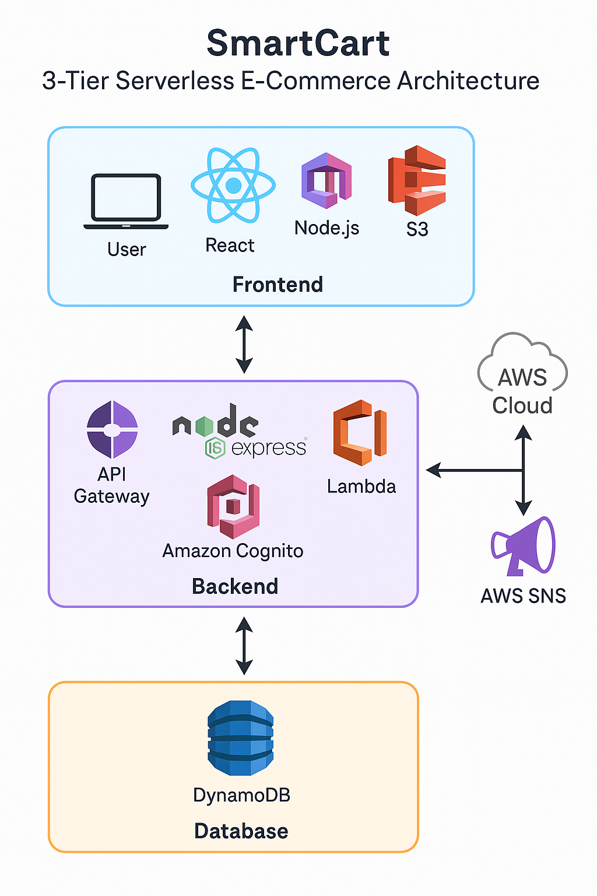

🛒 SmartCart - Serverless E-Commerce Platform on AWSLive Demo: SmartCart Frontend

📌 Project OverviewSmartCart is a modern 3-tier serverless e-commerce platform built entirely on AWS using React, Node.js, DynamoDB, and secure CI/CD pipelines with GitHub Actions + OIDC. It supports user registration, login, product browsing, cart syncing, order placement, and real-time order confirmation via email/SMS.

🚀 Features🧾 User Authentication: Sign up, login, and password reset with Amazon Cognito

🛍️ Product Catalog: Category filtering, search, and sorting

🛒 Cart Management: Persistent cart using DynamoDB

📦 Order Placement: Orders saved to DynamoDB

📬 Order Confirmation: Email/SMS alerts via SNS

📊 Monitoring: CloudWatch Alarms \& Dashboards

🌐 CI/CD: GitHub Actions with IAM OIDC (no access keys)

🧱 Architecture Diagram

🛠 Technologies UsedFrontend: React, Tailwind CSS

Backend: Node.js (Lambda), Express.js

Auth: Amazon Cognito

Database: Amazon DynamoDB

Storage: Amazon S3

CDN: Amazon CloudFront

Monitoring: Amazon CloudWatch

Notifications: Amazon SNS

CI/CD: GitHub Actions with OIDC

🧩 AWS ServicesComponentAWS ServiceAuthAmazon CognitoFrontend HostingS3 + CloudFrontBackend APIAPI Gateway + LambdaCart/Orders DBDynamoDBNotificationsSNS (SMS/Email)MonitoringCloudWatch Logs/AlarmsCI/CDGitHub Actions + IAM Role⚙️ Deployment InstructionsFrontend (React)Hosted on S3 with CloudFront distribution

Automatically deployed via GitHub Actions using IAM Role (OIDC)

On every main branch push:

React is built

Synced to S3

CloudFront is invalidated

Backend (Lambda Functions)SaveOrderFunction, GetOrdersFunction, SaveCartFunction, GetCartFunction

Triggered via API Gateway

Protected by Cognito authorizer

Deployed using GitHub Actions + OIDC

🔐 Security🔒 Least Privilege IAM Policies for all Lambda functions

✅ Cognito Authorizers protect API endpoints

📜 Audit Trail: CloudTrail + Athena

🛡️ Monitoring: CloudWatch Alarms on Lambda errors

🧪 How to Run Locally# Clone repo

$ git clone https://github.com/RavikumarKamani74/smartcart-aws-serverless

$ cd smartcart-aws-serverless/frontend

\# Install dependencies

$ npm install

\# Start local dev server

$ npm startNOTE: Backend is deployed on AWS and tied to Cognito/Auth. Local version only works for testing UI.

📸 Screenshots

